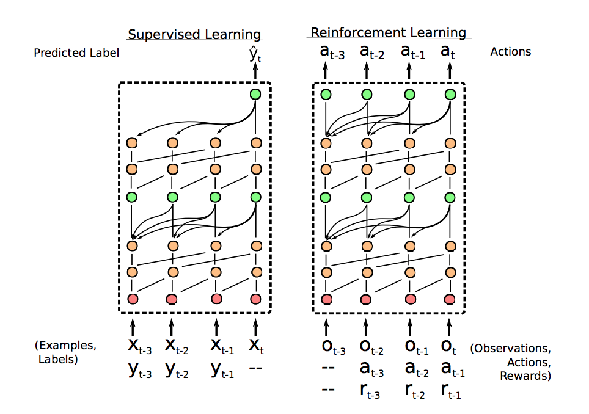
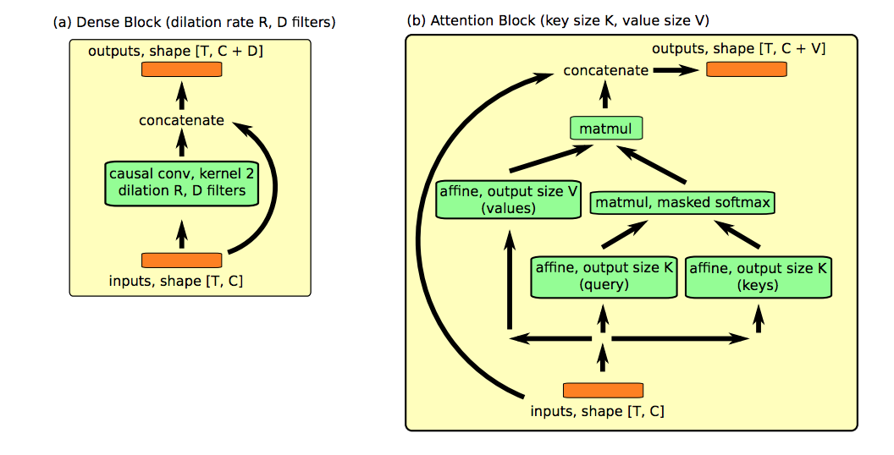
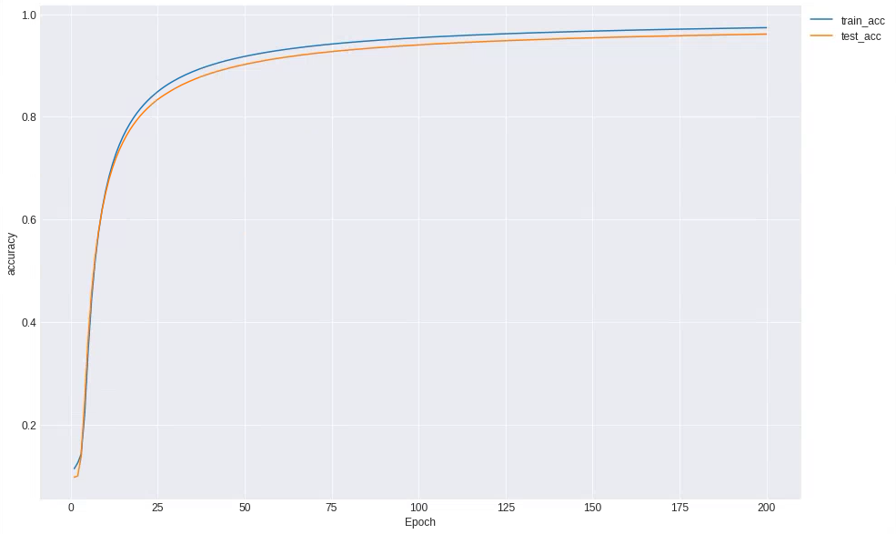

# SNAIL with Gluon

---

Gluon inplementation of [A Simple Neural Attentive Meta-Learniner](hhttps://openreview.net/pdf?id=B1DmUzWAW)

##### network structore


##### building block structure


## Requirements
- Python 3.6.1
- Mxnet 1.2.0
- pytorch 0.4.0 (only use data loading)
- tqdm

## Application
-  Omniglot

- Mini-Imagenet : working


## Usage

- arguments
  - batch_size : Define batch size (defualt=64)
  - epoches : Define total epoches (default=50)
  - GPU_COUNT : Use GPU count (default=2)
  - show_status : show loss and accuracy for each epoch (default=True)


###### default setting
```
python main.py
``` 
or

###### manual setting
```
python main.py --batch_size=24 --epoches=200 ..
```

## Results



## Reference
- https://github.com/sagelywizard/snail
- https://github.com/eambutu/snail-pytorch

